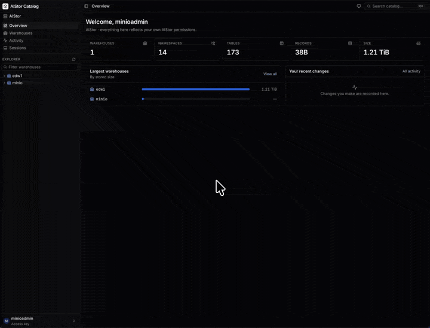

# AIStor Catalog UI

A multi-user, secure web UI for the **MinIO AIStor Tables** catalog (Apache Iceberg REST, `/_iceberg/v1`).

Everyone who signs in acts **as themselves**. The server exchanges each user's identity for their own short-lived AIStor STS credentials and signs every catalog request with them (SigV4, service `s3tables`). AIStor's own policies decide what each person can see and do, and AIStor's audit log shows the real user. The UI has no shared service account and adds no permissions of its own.

- **Backend**: Go backend-for-frontend (`backend/`). Handles OIDC, LDAP or access-key sign-in, encrypted server-side sessions, CSRF protection and step-up re-authentication. It forwards only a typed allow-list of AIStor Tables operations, validates every request, strips any storage credentials from responses, and keeps an audit trail and Prometheus metrics.
- **Frontend**: React 19, Vite, TypeScript, Tailwind v4 and Radix UI (`frontend/`). Includes an explorer tree, a command palette, server-side search, sort and pagination, light and dark themes, and a strict CSP.
- **Delivery**: one ~35 MB distroless, non-root container with the SPA embedded in the Go binary. The repo also ships Compose (AIStor, Keycloak, Redis) and Kubernetes manifests.

See [`docs/DESIGN.md`](docs/DESIGN.md) for the architecture and threat model, and [`docs/STYLE.md`](docs/STYLE.md) for the visual language.

## Status

**Phases 0–3 are complete**, plus the hardening round and the Apache Ossie semantic layer below.

- **Sign-in and security:** SSO (OIDC), LDAP and access-key sign-in; encrypted sessions; step-up re-authentication for destructive actions; a typed allow-list covering every AIStor Tables endpoint.
- **Browse:** overview, warehouses, nested namespaces, table and view pages (preview, schema history, partitioning, snapshots, maintenance, metadata, access helper), explorer tree, command palette, activity log.
- **Manage:**
  - create tables with a schema builder (nested struct/list/map types, partition spec, sort order, format version, properties, request preview);
  - register existing tables and views;
  - create views (SQL per dialect, output schema) and publish new view versions;
  - rename/move and drop (keeping data by default);
  - properties editors for namespaces, tables and views;
  - warehouse and table **encryption**, **tags** and **maintenance** settings (warehouse defaults with per-table overrides).
- **Evolve and operate:**
  - **Schema evolution:** add (including nested), rename, widen (only allowed promotions), make optional, document, reorder and drop columns. Dropping a column the partition spec, sort order or row key still uses is blocked. A diff preview is shown before committing.
  - **Partition and sort-order evolution:** partition field IDs are reused as Iceberg requires, and v1 tables keep removed fields as `void`.
  - **Snapshots:** roll back `main`, create tags and branches with retention settings, edit retention, remove references, and **expire** unreferenced snapshots (`remove-snapshots`).
  - **Time travel:** view a table as of a branch, tag or snapshot (`?at=`). Tags and snapshots show the schema they were written with; branches use the current schema, as Iceberg readers do. Data preview always reads the current snapshot.
  - **Row key:** choose identifier fields while evolving a schema. Only columns Iceberg allows are offered: required primitives other than float/double, not inside lists, maps or optional structs.
  - **Format upgrade** (v2 → v3).
- **Safe concurrent editing:** every commit carries Iceberg requirements built from the metadata you were looking at. If someone else changed the table meanwhile, AIStor rejects the commit (409); nothing is overwritten, and the UI offers a reload.
- **Multi-table change sets:** stage edits across tables of one warehouse and apply them in **one atomic transaction** (`transactions/commit`). Staged changes survive a page reload and are dropped when you sign out.
- **64-bit safety:** snapshot IDs are parsed and sent without precision loss.
- **Sessions:** each user sees where they are signed in and can revoke any session or all others. Admins can list and revoke everyone's sessions. The UI warns before an idle or absolute timeout. Background polling does not keep an idle tab signed in.
- **Expired credentials:** when the short-lived AIStor credentials of an LDAP or access-key session expire, the UI asks for the password in place and retries the request. The page and any staged changes are kept.
- **Search:** the command palette (⌘K) searches the whole catalog on the server, using your own credentials, so results only include what you may list. The walk is bounded by a request budget and a deadline, and the palette says when results were cut short or locations were skipped.
- **Activity:** server-side filters (time, source, outcome, text) with paging, and CSV export (cells are neutralised so spreadsheets cannot evaluate them as formulas).
- **Accessibility and devices:** WCAG 2.1 AA colour contrast, enforced by an axe scan in e2e; the sidebar becomes an overlay on phones; pages are code-split.
- **Semantic layer ([Apache Ossie](https://ossie.apache.org/)):** describe what tables mean. See [Semantic models](#semantic-models-apache-ossie) below.

## Semantic models (Apache Ossie)

Semantic models describe the data in business terms: dataset and field descriptions, synonyms, keys, relationships (joins), metrics (SQL) and instructions for AI agents. They are standard [Apache Ossie](https://github.com/apache/ossie) `0.2.0.dev0` documents.



- **Built from the catalog.** Pick tables and each one becomes a dataset: columns become fields (struct leaves as `shipping.city`), types map to Ossie datatypes, column docs become descriptions, and the row key becomes the primary key.
- **Where to edit them:**
  - a namespace's **Semantic models** tab;
  - the model editor: overview, datasets, relationships with join suggestions and a diagram, metrics with `dataset.field` autocomplete, YAML, history, catalog sync;
  - a table's **Semantics** tab.
- **Validated.** Every edit is checked live against the official JSON Schema, for structure (unique names, joins and metric references that exist), and against the catalog (columns and types).
- **Stored as plain YAML objects** in a bucket (`s3://<bucket>/<warehouse>/<namespace…>/<model>.ossie.yaml`):
  - they are read and written with each user's own AIStor credentials, so PBAC on the bucket prefix decides who may read or edit;
  - saves are conditional (`If-Match`), so concurrent edits conflict instead of overwriting;
  - with bucket versioning you get history, diff and restore;
  - every change is audited.
- **Kept in sync.** Datasets record the table UUID and fields record the Iceberg field ID (in an `AISTOR_CATALOG` custom extension, which other tools ignore).
  - Renamed tables and columns, dropped columns, type changes, new columns and row-key changes are detected and fixed in one click.
  - The schema evolution dialog warns when a column you change is used by a model.
- **Served to tools and agents** (`semantic.serving`). The endpoints are read-only and authenticated with OIDC bearer tokens. Each token is exchanged for the caller's own AIStor credentials, as at login.
  - `GET /ossie/v1/models`: index of models the caller may read.
  - `GET /ossie/v1/models/{cluster}/{warehouse}/{namespace}/{model}`: YAML, or JSON with `?format=json` or `Accept: application/json`. Supports ETag and `If-None-Match`. Namespace levels are joined with `%1F`.
  - `GET /ossie/v1/search?q=`: search names, synonyms and descriptions.
  - `GET /ossie/v1/schema`: the Ossie JSON Schema (public).
  - `POST /ossie/mcp`: an MCP server (Streamable HTTP, JSON responses) with the read-only tools `list_models`, `get_model` and `search_semantics`. `/.well-known/oauth-protected-resource` tells MCP clients where to get tokens.

```bash
# A model as YAML (token from your IdP; its audience must be accepted, see semantic.serving.audiences)
curl -H "Authorization: Bearer $TOKEN" https://catalog.example.com/ossie/v1/models/prod/analytics/sales/retail
# MCP
curl -H "Authorization: Bearer $TOKEN" -H 'Content-Type: application/json' \
  -d '{"jsonrpc":"2.0","id":1,"method":"tools/call","params":{"name":"search_semantics","arguments":{"query":"revenue"}}}' \
  https://catalog.example.com/ossie/mcp
```

**Setup:**
1. Create the bucket and enable versioning (the Compose stack does this).
2. Grant `s3:GetObject`, `s3:ListBucket`, `s3:ListBucketVersions` and `s3:GetObjectVersion` (readers), plus `s3:PutObject` and `s3:DeleteObject` (editors) on it. See `deploy/compose/policies/`.
3. Set `semantic.enabled`.
4. For serving, AIStor must accept the same tokens for `AssumeRoleWithWebIdentity`.

The design is in [docs/SEMANTIC_LAYER.md](docs/SEMANTIC_LAYER.md).

## Quick start (no AIStor needed)

The repo includes an in-memory AIStor **test server** (used by the e2e tests, never shipped). It verifies SigV4 signatures and enforces per-user permissions.

```bash
make deps          # npm ci for frontend and e2e
make dev           # test server :9000 + backend :8080 + Vite :5173
open http://localhost:5173     # alice / alice-password (full access), bob / bob-password (read-only)
```

## Full stack with AIStor + Keycloak (Docker Compose)

```bash
make compose-env   # writes deploy/compose/.env with random secrets
$EDITOR deploy/compose/.env    # set AISTOR_LICENSE
make up            # AIStor, Keycloak, Redis, catalog UI
open http://localhost:8080     # alice / bob, passwords in deploy/compose/.env
```

Keycloak puts each user into a group (`catalog-admin`, `catalog-readonly`). AIStor maps the `groups` claim to policies of the same names, which live in `deploy/compose/policies/`. Keycloak is published as `keycloak.localhost:8081`. Browsers resolve `*.localhost` to loopback, and inside the Compose network the same name is an alias of the Keycloak container, so every party sees the same issuer.

## On a workstation, over HTTPS on the LAN

To try the UI against an existing AIStor from other machines on your network:

```bash
mkdir -p deploy/local/tls   # git-ignored: holds the session key and TLS key
cp deploy/lan/config.example.yaml deploy/local/config.yaml   # fill in the placeholders
mkcert -cert-file deploy/local/tls/cert.pem -key-file deploy/local/tls/key.pem <host>.local <lan-ip> localhost 127.0.0.1 ::1
chmod 644 deploy/local/tls/key.pem   # readable by the container's non-root user
docker build -t aistor-catalog-ui:local .
docker run -d --name aistor-ui-local --restart unless-stopped -p 443:8443 --read-only \
  -v "$PWD/deploy/local/config.yaml:/etc/aistor-ui/config.yaml:ro" -v "$PWD/deploy/local/tls:/etc/aistor-ui/tls:ro" aistor-catalog-ui:local
```

Every device must trust mkcert's CA:
- **This machine:** run `mkcert -install`.
- **Other devices:** import `$(mkcert -CAROOT)/rootCA.pem` as a trusted root. Never copy `rootCA-key.pem`.

People must open one of the names in `publicUrl` / `extraOrigins`; sign-in from any other origin is rejected. For certificates that every device already trusts, use a real certificate for a DNS name instead of mkcert.

## TrueNAS app

On TrueNAS 24.10 or later, install the UI as a custom app: **Apps → Discover Apps → ⋮ → Install via YAML** with [`deploy/truenas/docker-compose.yaml`](deploy/truenas/docker-compose.yaml). Edit the settings block at the top (address and AIStor endpoint). The UI serves HTTPS on port 30443 with a self-signed certificate that it creates on first start and keeps. See [deploy/truenas/README.md](deploy/truenas/README.md).

## Kubernetes

### Helm

```bash
helm install catalog deploy/helm/aistor-catalog-ui -n aistor-catalog --create-namespace \
  --set config.server.publicUrl=https://catalog.example.com \
  --set 'config.clusters[0].endpoint=https://aistor.example.com' \
  --set ingress.enabled=true --set 'ingress.hosts[0].host=catalog.example.com'
```

`config` is rendered as the application config file, so every key in the table below can be set there. The chart creates a Secret with a generated session key (kept across upgrades), or uses `secrets.existingSecret`. By default it also runs a password-protected, single-instance Redis (`redis.enabled`) that only the UI can reach. For HA, set `redis.enabled=false` and point `config.session.store` at a managed Redis. Optional extras: private CA bundles (`ca`), a ServiceMonitor, a PDB and NetworkPolicies.

### Kustomize

```bash
kubectl -n aistor-catalog create secret generic aistor-catalog-ui \
  --from-literal=session-key="$(openssl rand -base64 32)" \
  --from-literal=oidc-client-secret='…' --from-literal=redis-password='…'
kubectl apply -k deploy/kubernetes     # edit configmap.yaml first
```

An Ingress is included (edit the host and TLS secret). If you have no Redis, add `components: [components/redis]` to the kustomization and point `session.store` at `redis://:${REDIS_PASSWORD}@aistor-catalog-ui-redis:6379/0`.

The deployment runs 2 replicas under the `restricted` Pod Security Standard. It uses a read-only root filesystem, drops all capabilities, and has probes, a PDB and a NetworkPolicy. Replicas share sessions through Redis.

## Building the image

```bash
make image                                  # docker build -t aistor-catalog-ui:<version> .
# Behind a TLS-inspecting proxy:
make image DOCKER_BUILD_FLAGS="--secret id=extra_ca,src=/path/to/ca.pem"
```

The base images are build args (`NODE_IMAGE`, `GO_IMAGE`, `RUNTIME_IMAGE`), so you can point them at an internal mirror. CI publishes multi-arch images to `ghcr.io/<owner>/<repo>`.

## Configuration

The server reads a YAML file (`-config`, or `AISTOR_UI_CONFIG`), or YAML held in an environment variable with `-config env:NAME` (for platforms that cannot mount a file into a read-only container). `${VAR}` references are expanded from the environment, and any secret can be supplied as a `*File` path instead. Start from `deploy/compose/config.yaml` or `deploy/kubernetes/configmap.yaml`.

| Key | Meaning |
|---|---|
| `server.publicUrl` | External origin. Must be https unless it is loopback. Used for cookies, CSRF origin checks and OIDC redirects |
| `server.tlsCertFile` / `tlsKeyFile` | Serve HTTPS in-process with this certificate |
| `server.tlsSelfSigned` | Create a self-signed certificate at those paths when none is there. The UI replaces only certificates it created itself, and only when they are about to expire or no longer cover `publicUrl` / `extraOrigins` |
| `server.trustProxy` | Take the client IP from `X-Forwarded-For` (for rate limits and audit) |
| `session.store` | `memory` (single replica) or `redis://` / `rediss://` URL |
| `session.keys[]` | AES-256 keys (`value` or `file`). The first key encrypts; all keys decrypt, which allows rotation. `generate: true` with a `file` creates a random key there on first start and keeps it |
| `session.idleTimeout` / `absoluteTimeout` / `stepUpValidFor` | Default 30m / 12h / 5m |
| `auth.oidc` | `issuer`, `clientId`, `clientSecret[File]`, `scopes`, `groupsClaim`, `usernameClaim`, `stsToken` (`id_token` or `access_token`), `discoveryUrl` (split-horizon), `endSessionRedirect`, `caFile` (PEM bundle trusted for the IdP, in addition to system roots) |
| `auth.ldap.enabled` | Directory sign-in through AIStor `AssumeRoleWithLDAPIdentity` |
| `auth.builtin.enabled` | Access-key sign-in through STS `AssumeRole`. The secret is used once and never stored. Intended for labs |
| `auth.adminGroups` / `adminUsers` | Who may see everyone's activity. This grants **no** catalog permissions |
| `clusters[]` | `id`, `name`, `endpoint`, `stsEndpoint`, `region`, `caFile`, `stsDuration`, `timeout` |
| `limits` | `requestsPerMinute` (per session), `loginPerMinute` (per IP), `maxBodyBytes`, `previewMaxRows` (≤1000). With a Redis session store, the limits are shared by all replicas (fixed one-minute windows). If Redis is unreachable, requests are allowed rather than failed |
| `semantic.enabled` / `bucket` | Apache Ossie semantic models stored in this bucket on each cluster (versioning recommended) |
| `semantic.maxModelBytes` / `maxScan` | Largest model document (default 1 MiB); how many models a search, usage check or index reads (default 200) |
| `semantic.catalogAliases` | Warehouse → catalog name that engines use, for dataset `source` values (default: the warehouse name) |
| `semantic.serving` | `enabled` (requires `auth.oidc`), `audiences` accepted in bearer tokens (default: the OIDC client ID), `requestsPerMinute` per token subject (default 120) |
| `audit.webhookUrl` | POST each audit record as JSON. Records are always logged to stdout as well |
| `audit.webhookSecret[File]` | Sign webhook deliveries: `X-Aistor-Audit-Timestamp` (unix seconds) and `X-Aistor-Audit-Signature: sha256=<hex HMAC-SHA256(secret, timestamp + "." + body)>`. Receivers should reject timestamps older than a few minutes |

Operational endpoints: `/healthz`, `/readyz` (checks the session store), and `/metrics` and `/healthz` on `server.metricsListen`. The image's health check runs `aistor-ui -healthcheck auto`, which probes the metrics listener (or the main listener when it serves plain HTTP).

> **LDAP and access-key sessions** cannot silently renew their AIStor credentials, because the password is not kept. When the credentials expire, the UI asks for the password again (no sign-out, nothing lost). Set `stsDuration` close to `session.absoluteTimeout` to make that rare. OIDC sessions renew through the refresh token.

## Development

```text
backend/            Go BFF
  cmd/aistor-ui           server entry point
  cmd/aistor-testserver   in-memory AIStor for e2e tests (not shipped)
  internal/catalog        allow-list routes, validation, redaction, proxy
  internal/server         HTTP wiring, auth handlers, middleware
  internal/aistor         SigV4 catalog client + STS
  internal/session        encrypted sessions (memory / Redis)
  internal/semantic       Apache Ossie models: parse/validate (embedded official schema), canonical YAML,
                          generation from Iceberg, drift, object storage, UI API, /ossie/v1 and MCP
  internal/audit, auth, config, web (embedded SPA)
frontend/           React SPA (src/features, src/layout, src/components/ui, src/lib)
e2e/                Playwright tests
deploy/             compose/, helm/, kubernetes/ (+ components/redis), dev/
```

```bash
make test    # go vet + go test -race, eslint, tsc, vitest
make e2e     # builds everything, runs Playwright against the test server
```

The e2e suite covers sign-in, browsing, every editor, conflicts, change sets, time travel, sessions, re-authentication, search, activity export, a phone-sized layout and an axe WCAG 2.1 AA scan. The test server exposes a local control port (`-control`, default `127.0.0.1:9001`) so tests can expire credentials.

**Against a real AIStor** (read-only): run the UI container with a config that points at your cluster (keep it in the git-ignored `deploy/local/`), then walk every page and tab with Playwright. The walk records the error states the UI shows and takes screenshots, and it never writes.

```bash
docker build -t aistor-catalog-ui:local .
docker run -d --name aistor-ui-local -p 8080:8080 --read-only -v "$PWD/deploy/local/config.yaml:/etc/aistor-ui/config.yaml:ro" aistor-catalog-ui:local
LIVE_ACCESS_KEY=… LIVE_SECRET_KEY=… LIVE_CLUSTER=lab E2E_SCREENSHOTS=/tmp/shots make e2e-live   # findings: e2e/test-results/live-findings.json
```

**Write tests against a real AIStor** (`make e2e-live-write`):
- They create their own `uitest_<run>_*` tables, view and semantic model in a scratch namespace (`LIVE_WAREHOUSE`/`LIVE_NS`, default `edw1.scratch`).
- They append data with PyIceberg (`e2e/live/append.py`, which refuses any table not named `uitest_*`), then exercise the UI: time travel, tags, rollback, expiry, schema/partition/sort evolution, row key, properties, table tags, maintenance, format upgrade, change sets, rename, drop and restore via Register, views and semantic models.
- Everything is dropped with purge at the end; `e2e/live/cleanup.sh` removes leftovers from an interrupted run.
- Set `LIVE_S3_ENDPOINT` to the AIStor S3 API (`http://<aistor-host>:<s3-port>`); PyIceberg appends data through it.
- Install PyIceberg first, for example `python3 -m venv .venv && .venv/bin/pip install "pyiceberg[pyarrow,s3fs]"`, and set `LIVE_PYTHON=.venv/bin/python`.

What real AIStor does that the test server does not model:
- **The `minio` warehouse** is a reserved, read-only system warehouse. Its namespaces mirror buckets, and it lists placeholder `namespace` tables that cannot be loaded. The UI labels it and hides write actions.
- **Missing maintenance or encryption configuration** is answered with 404. The UI shows it as "not configured" or "not yet run".
- **Preview** is read by AIStor itself, which cannot read some layouts (for example, tables with delete files). The UI explains this instead of showing a generic error.
- **Registering** a metadata file that a live table already uses is refused ("Table already exists"). Register restores tables whose catalog entry was dropped.
- **New tables** get a table-level compaction configuration with status "disabled".
- **Snapshot summaries** often omit `total-*` counts (they are optional in Iceberg), so the records, files and size figures show "—" with a note.

CI (`.github/workflows/`) runs:

- `ci.yml`: Go (gofmt, vet, race tests), frontend (lint, typecheck, unit, build), Helm lint plus kubeconform for the chart and kustomize, e2e, and a multi-arch image.
- The e2e suite also covers semantic models end to end: generate, document, relationships, metrics, YAML, history, conflicts, read-only denial, drift fixing after a column rename, search, import and an axe scan of every editor tab.
- `security.yml` (on PRs, main and weekly): govulncheck, `npm audit`, CodeQL (Go, TypeScript), a Trivy image scan with SARIF and SBOM, a Trivy misconfiguration scan of the Dockerfile and manifests, and an OWASP ZAP baseline against the running app (accepted findings are in `.zap/rules.tsv`).
- Dependabot keeps Go, npm, Docker and Actions dependencies current.

When Chromium comes preinstalled (for example in CI images or sandboxes), set `CHROMIUM_PATH=/path/to/chrome` for `make e2e`.
